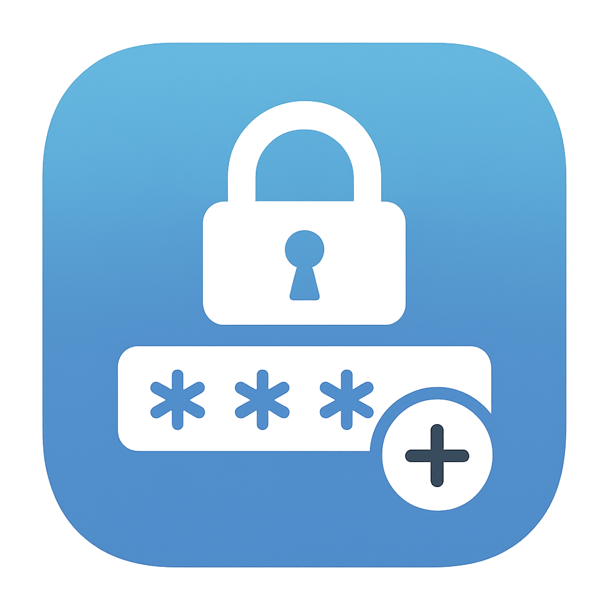
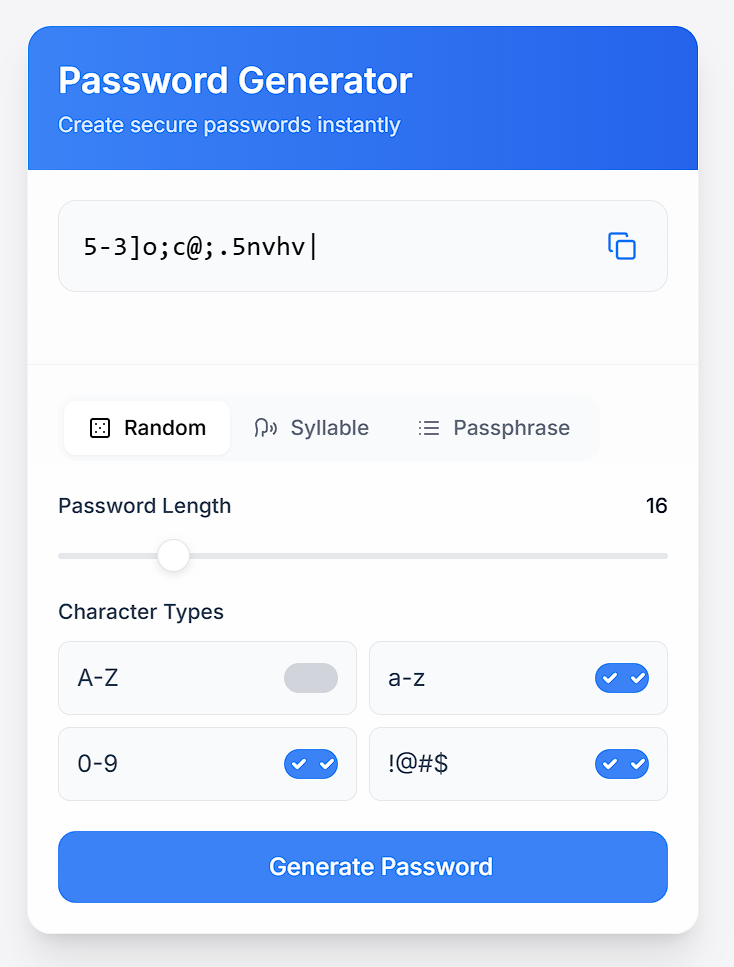

# Secure Password Generator

A modern, responsive web application for generating secure passwords and passphrases with customizable options.

## Features

- **Three Generation Modes**:
  - Random: Fully random characters with customizable character sets
  - Syllable: Pronounceable passwords using syllable patterns
  - Passphrase: Memorable word combinations with separators

- **Customization Options**:
  - Adjustable password length (6-64 characters)
  - Toggle character types (uppercase, lowercase, numbers, symbols)
  - Multiple languages for passphrases (English, German)
  - Word count and separator options for passphrases
  - Option to add random numbers to passphrases

- **User Experience**:
  - Clean, iOS-inspired UI with smooth animations
  - One-click copy to clipboard with visual feedback
  - Responsive design works on all device sizes
  - Instant generation with loading indicators

## Technologies Used

- HTML5, CSS3, JavaScript (ES6)
- [Tailwind CSS](https://tailwindcss.com/) for styling
- [Lucide Icons](https://lucide.dev/) for beautiful icons
- [Inter Font](https://rsms.me/inter/) for typography
- Modern CSS features like backdrop-filter for frosted glass effect

## How to Use

1. Open `index.html` in any modern web browser
2. Select your preferred generation mode (Random/Syllable/Passphrase)
3. Adjust the settings to your preference
4. Click "Generate Password" to create a new password
5. Click the copy icon to copy the password to clipboard

## Browser Support

The application works in all modern browsers including:
- Chrome
- Firefox
- Safari
- Edge

## License

This project is open source and available under the [MIT License](LICENSE).

## Contributing

Contributions are welcome! Please open an issue or submit a pull request for any improvements.
